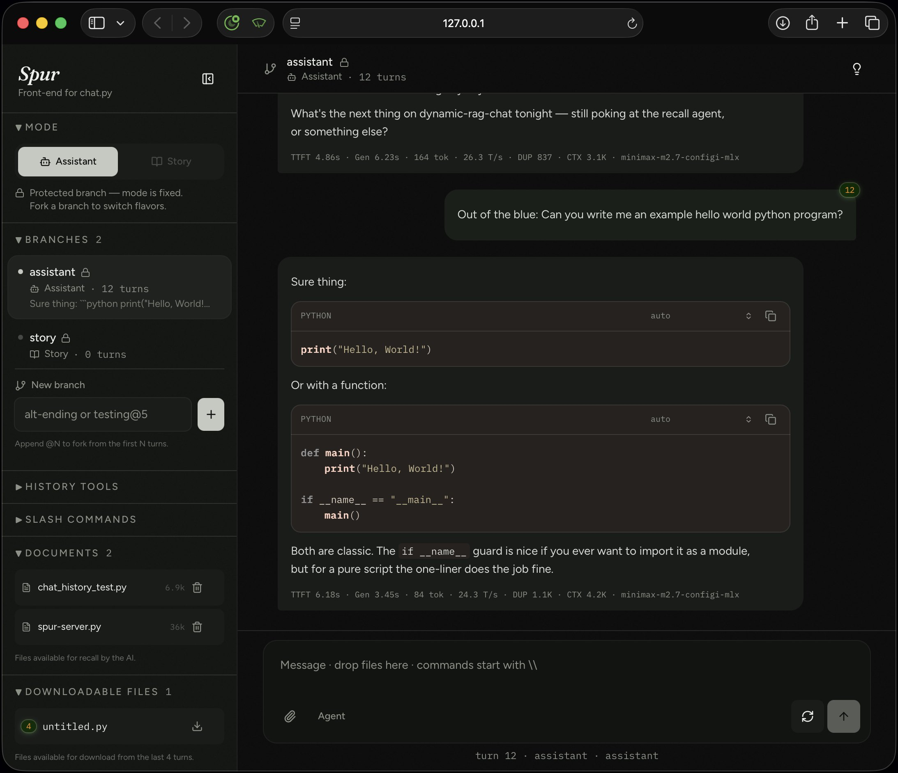
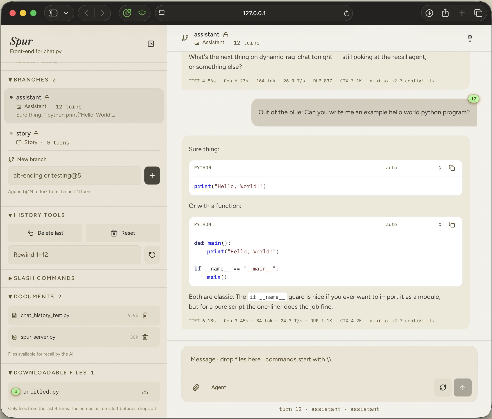

# Spur

Browser UI for [dynamic-rag-chat](https://github.com/milljm/dynamic-rag-chat). This folder is the view; `../spur-server.py` is the HTTP contract.



Light mode. Code fences have a Pygments theme dropdown (sticky; auto is coffee / stata-light).




## Run

From the repo root (not this folder):

```bash
./chat.py --spur
./chat.py --spur --assistant-mode
```

That starts **one process** on `http://127.0.0.1:8765` (adapter + built UI). First run builds the UI. `Ctrl-C` stops it. Force a rebuild: `./chat.py --spur --spur-rebuild`.

Split-dev (UI hot reload):

```bash
python spur-server.py
# other terminal:
cd spur
cp .env.example .env   # VITE_CHAT_API=http://127.0.0.1:8765
npm install
npm run dev
```

Without `VITE_CHAT_API`, the UI is demo mode and never talks to your history. `./chat.py --spur` always sets it.

## What you see

- **Mode / Branches / History / Slash** — the same rules as `chat.py` (`story` and `assistant` are protected).
- **Composer paperclip** — attach files *this turn*. After the turn they become Documents (assistant mode).
- **Documents** — whole files in `vector_dir/attachments/`. Mention a name to load it; the model can emit `<NEED_GOLD:file>` and Spur shows `Recalling Document…`.
- **Projects** — one row per project root. **Add project dir** registers a directory in place. If it is not git, Coding asks before `git init`. `<GIT:status>` is local-only. Workers: `<RUN:file.py args>`.
- **Downloadable Files** — named code fences on assistant messages still in this branch.
- **Status** — `RAG Processing…` → `Agent Web Search…` (when it searches) → `Processing Prompt… [model] [route] [12.4k]` → `Streaming…`.

SSE events from the adapter: `status`, `token`, `reasoning`, `documents`, `project`, `usage`, `done`.

## What Spur does not own

History, RAG, the Documents cabinet, branch lock rules, agent tools, and `save_history` stay in `chat.py`. Edit the adapter next to `chat.py`, not here.
